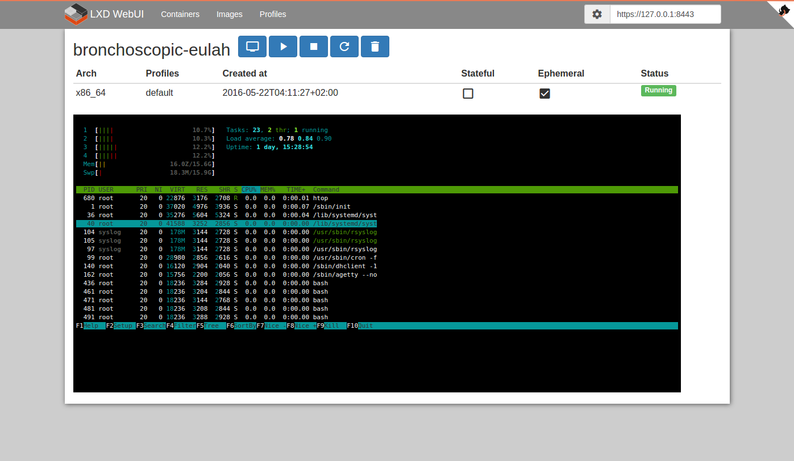

# LXD WebUI [](https://travis-ci.org/aarnaud/lxd-webui)

> Demo on http://aarnaud.github.io/lxd-webui/




## Release builds

**The release builds of static webapp is available on https://github.com/aarnaud/lxd-webui/releases**

## Build from sources

Follow the instructions in this [link](doc/build-from-sources.md) 

## Configuration on LXD

### Allow LXD to listen on 8443 port

```bash
lxc config set core.https_address [::]:8443
```

### Add CORS settings on LXD (Since LXD 2.0.0.rc2)

```bash
lxc config set core.https_allowed_origin "*" # SECURITY WARNING: prefer to restrict with lxd-webui url 
lxc config set core.https_allowed_methods "GET, POST, PUT, PATCH, DELETE, OPTIONS"
lxc config set core.https_allowed_headers "Content-Type"
```

### Accept self-sign server certificate 

Go on LXD server url (https://127.0.0.1:8443) with your browser.

### Generate x509 certificate for browser authentification

- Generate a client private key
```bash
openssl genrsa -out lxd-webui.key 4096
```

- Generate a certificate request (csr)
```bash
openssl req -new -key lxd-webui.key -out lxd-webui.csr
```

- Generate an auto-sign certificate
```bash
openssl x509 -req -days 3650 -in lxd-webui.csr -signkey lxd-webui.key -out lxd-webui.crt
```

- Export keys to pkcs12 for use in browers
```bash
openssl pkcs12 -keypbe PBE-SHA1-3DES -certpbe PBE-SHA1-3DES -export -in lxd-webui.crt -inkey lxd-webui.key -out lxd-webui.pfx -name "LXD WebUI"
```

- Import lxd-webui.pfx in your brower : 
    - [Google Chrome on Linux](https://support.globalsign.com/customer/portal/articles/1215006-install-pkcs-12-file---linux-ubuntu-using-chrome)
    - [Google Chrome on Windows](https://www.comodo.com/support/products/authentication_certs/setup/win_chrome.php?key5sk1=649f7696ddcd15b926ed0862b303a6e7b4dd8204) 
    - [Firefox](http://www.digi-sign.com/support/client%20certificates/import%20firefox)
    
- Authorize the certificate on LXD server.
```bash
lxc config trust add lxd-webui.crt
```